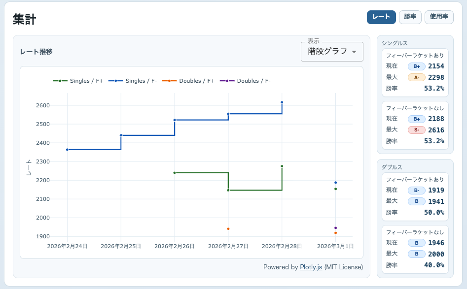
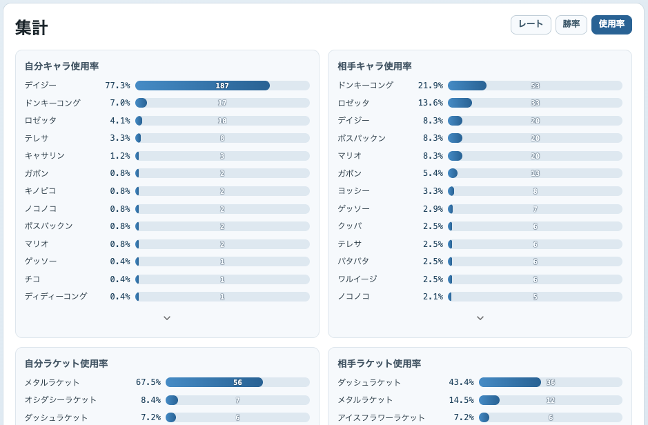

# MFStat

マリオテニスフィーバーのランクマッチ結果を記録する、個人向けローカルWebアプリです。





## リリース版のダウンロードと使い方

最新版の一覧: [GitHub Releases](https://github.com/nozma/mfstat/releases/latest)

- macOS (Apple Silicon): [MFStat-macos-arm64.zip](https://github.com/nozma/mfstat/releases/latest/download/MFStat-macos-arm64.zip)
- macOS (Intel): [MFStat-macos-x86_64.zip](https://github.com/nozma/mfstat/releases/latest/download/MFStat-macos-x86_64.zip)
- Windows (x64): [MFStat-windows-x64.zip](https://github.com/nozma/mfstat/releases/latest/download/MFStat-windows-x64.zip)

### 使い方
1. 環境に合った zip ファイルをダウンロードします。
2. zip を解凍します。
3. macOS は `MFStat.app`、Windows は `MFStat.exe` を起動します。

### 起動時の注意
- 配布ファイルにはコード署名がないため、初回起動時に OS の警告が表示される場合があります。

#### macOS
- macOS で `開発元を確認できないため開けません` と表示された場合は、Finder で `MFStat.app` を右クリックして `開く` を選び、確認ダイアログから起動してください。
- それでも起動できない場合は、`システム設定 > プライバシーとセキュリティ` でブロックされたアプリの実行を許可してください。

#### Windows
- Windows で SmartScreen の警告が表示された場合は、`詳細情報` から `実行` を選んで起動してください。

## 技術スタック
- Frontend: React + Vite + TypeScript
- Backend: FastAPI + SQLModel
- DB: SQLite

## セットアップ

### Backend
```bash
cd backend
python3 -m venv .venv
source .venv/bin/activate
pip install -r requirements.txt
```

### Frontend
```bash
cd frontend
npm install
```

## 開発起動
```bash
make dev
```

- Frontend: `http://localhost:5173`
- Backend API: `http://localhost:8000`

## デスクトップ起動
```bash
make desktop
```

## DB保存先
- macOS: `~/Library/Application Support/mfstat/mfstat.db`
- Windows: `%APPDATA%/mfstat/mfstat.db`
- Linux: `$XDG_DATA_HOME/mfstat/mfstat.db`（未設定時: `~/.local/share/mfstat/mfstat.db`）

## サードパーティライセンス
- Plotly.js（`plotly.js-dist-min`）: MIT License
- 詳細: `frontend/THIRD_PARTY_LICENSES.md`
